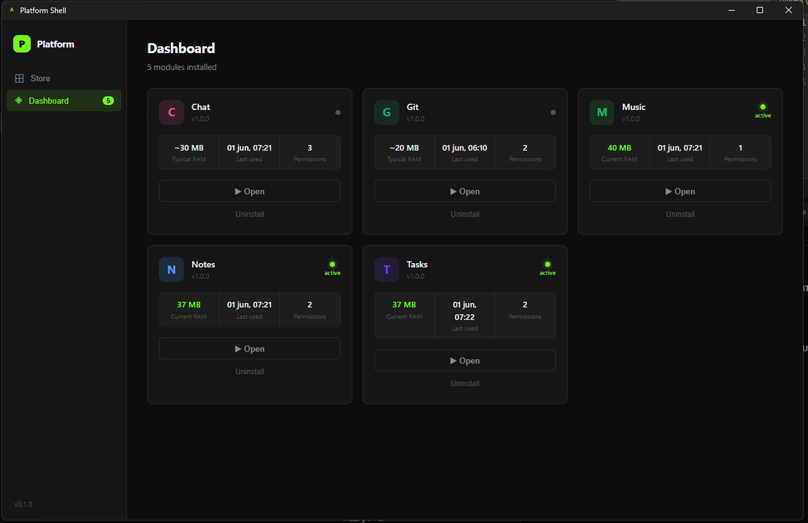
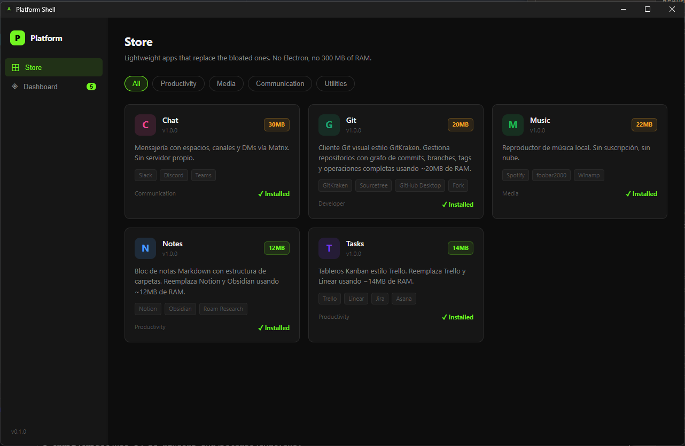
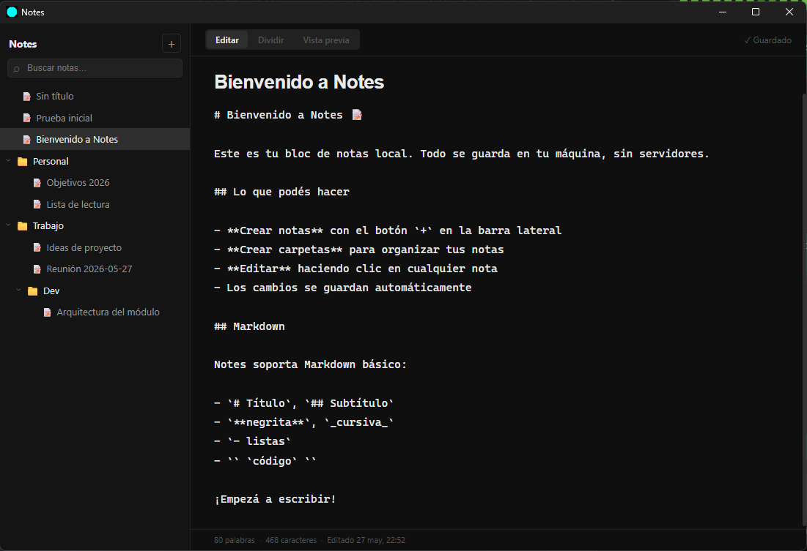
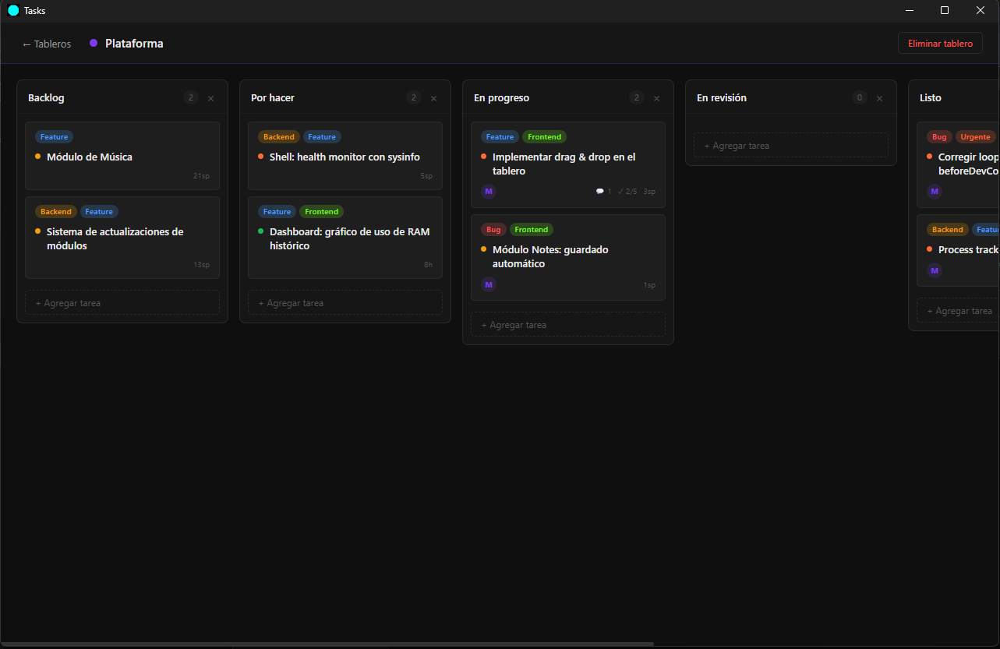
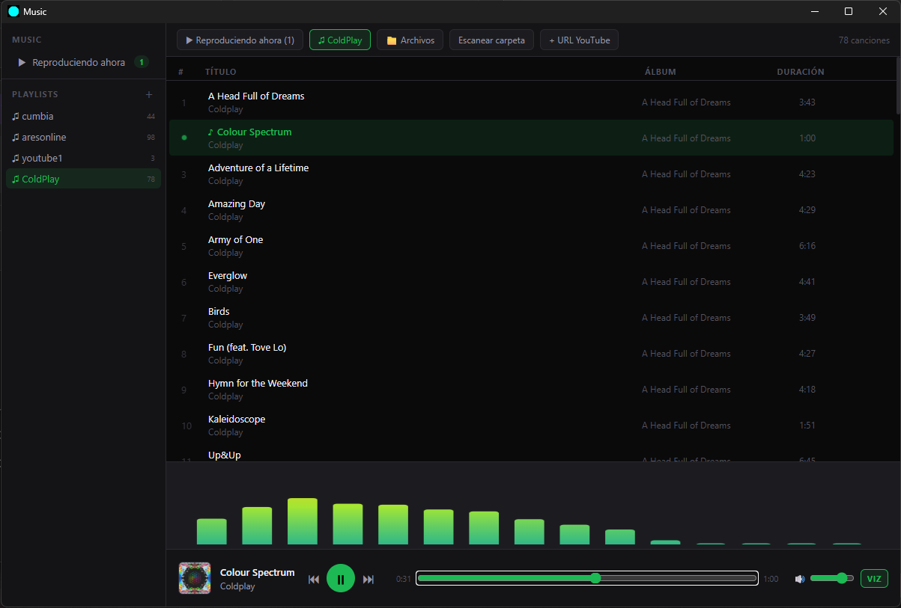
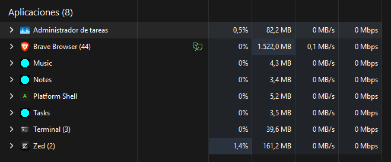

# Ants

I was getting tired of thinking about spending $3,000 to upgrade my computer just because I no longer have enough RAM to work comfortably — because every app I use daily consumes more and more memory, even though I end up using mostly the basic features. That got me thinking: why not build a suite of applications with optimal memory usage, so I can keep RAM free for the processes that actually need it?

Most of the apps we use every day are built with Electron. Electron is convenient to develop with, sure — but there's a big catch: it consumes a huge amount of RAM because it's essentially a full browser embedded inside an application. Every Slack window, every Spotify client, every Notion tab is secretly running Chrome under the hood.

That's why I started this project. I want to build everyday-use applications that I don't have to close just to free up memory for something else. No more choosing between your music player and your code editor.

**Let's make the low-memory software revolution happen** — against the big corporations that keep bloating their systems so we end up spending money on more expensive machines.

---

A modular desktop platform that replaces bloated Electron apps (Spotify, Slack, Notion, etc.) with lightweight native alternatives — built with **Tauri (Rust + native WebView)**.

Each module runs as an independent OS process and communicates with a central shell via JSON-RPC 2.0 over a named pipe (Windows) or Unix socket (macOS/Linux). The goal: **10–50 MB RAM per module** instead of the 150–400 MB typical of Electron apps.

---

## Status

> **Pre-alpha — active development.**
> The project is not yet ready for general use. APIs, module formats, and IPC contracts may change without notice. Contributions and feedback are very welcome.

---

## Screenshots








---

## How it works

```
Shell (Tauri)
├── Dashboard       — installed modules + live RAM/CPU stats
├── Store           — browse and install modules
├── Process Manager — spawn, watchdog, and kill module processes
└── shell.db        — local SQLite registry

Module (independent OS process)
├── Native binary   — app logic + Tauri window
├── Own SQLite DB   — isolated from every other module
└── manifest.json   — declares permissions and IPC methods
```

The shell **never** touches a module's database directly. Data flows exclusively through IPC.

---

## Requirements

| Tool | Version |
|---|---|
| Rust | 1.77+ |
| Node.js | 18+ |
| pnpm | 8+ |
| Tauri CLI | 2.x |

Install the Tauri CLI if you don't have it:

```bash
cargo install tauri-cli --version "^2"
```

---

## Getting started

### Clone the repository

```bash
git clone https://github.com/<your-username>/trimOS.git
cd trimOS
```

### Run a module in development mode

Each module is a self-contained Tauri app. To run the Music module:

```bash
cd modules/music
pnpm install
cargo tauri dev
```

### Build a module for production

```bash
cd modules/music
pnpm install
cargo tauri build
```

The compiled binary and installer will be placed in `modules/music/src-tauri/target/release/`.

### Run tests

```bash
# Unit and integration tests for a module's Rust backend
cd modules/music
cargo test

# All tests in the module SDK
cd module-sdk
cargo test
```

### Lint

```bash
rustfmt --check src/**/*.rs
```

---

## Project structure

```
Ants/
├── ARCHITECTURE.md       — full technical design document
├── CONTRIBUTING.md       — contribution guide (coming soon)
├── module-sdk/           — Rust crate that modules use to talk to the shell
├── shell/                — main Tauri shell application (in development)
└── modules/
    └── music/            — Music player module (Tauri + Rust + React)
```

---

## Modules

| Module | Status | Replaces |
|---|---|---|
| Music | Pre-alpha | Spotify / Winamp / Youtube Music |
| Notes | Planned | Notion / Obsidian |
| Tasks | Planned | Todoist |

---

## Contributing

Contributions are welcome. Please read [CONTRIBUTING.md](CONTRIBUTING.md) before opening a pull request.

Areas where help is especially appreciated:

- Shell dashboard and store UI
- New modules (see `ARCHITECTURE.md` for the module spec)
- Linux and macOS testing
- Performance benchmarks

---

## Architecture

See [ARCHITECTURE.md](ARCHITECTURE.md) for the full design document covering the IPC contract, module manifest format, database layout, process lifecycle, and development roadmap.

---

## License

To be decided. All rights reserved until a license is chosen.
